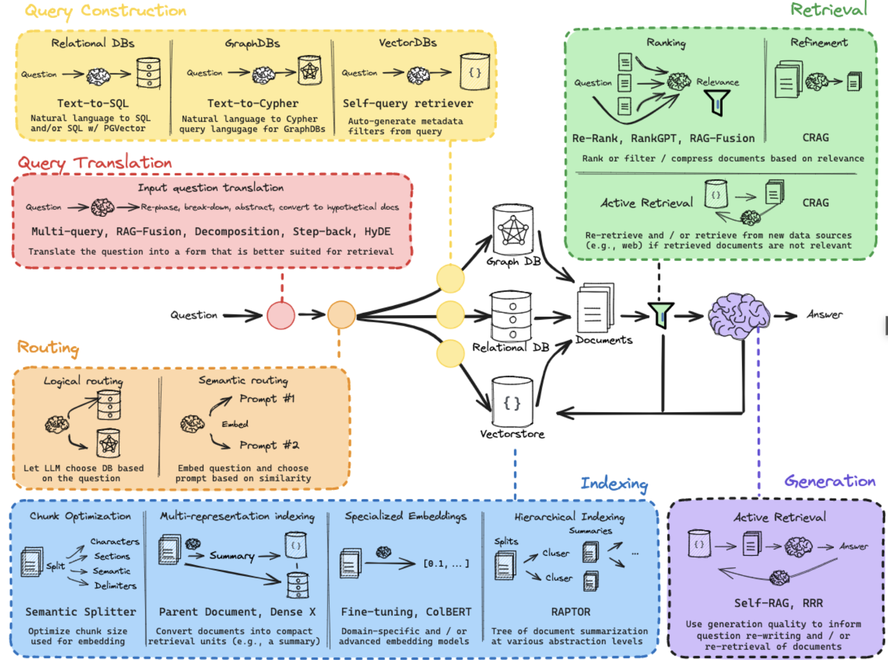

# Industrie-KI Assistent – RAG + SQL Agent

Ein Assistenzsystem für wissenschaftliche Mitarbeiter, das Wissen aus unstrukturierten PDFs (Forschungsberichte) mit strukturierten Messdaten (SQL) verknüpft. Der Fokus liegt auf **Datensouveränität** durch lokale LLM-Inferenz via LM Studio.

## Architektur

```
Nutzeranfrage
      │
      ▼
┌─────────────┐
│  Streamlit   │  ← Chat-Interface mit Memory
│   (app.py)   │
└──────┬───────┘
       │
       ▼
┌─────────────────┐
│  Intelligenter   │  ← Zweistufiger Router-Agent
│  Agent (agent.py)│
└───┬─────────┬───┘
    │         │
    ▼         ▼
┌────────┐ ┌───────────┐
│ vector │ │ sql_query  │
│_search │ │            │
└───┬────┘ └─────┬─────┘
    │            │
    ▼            ▼
┌────────────┐ ┌──────────────┐
│ ChromaDB   │ │ SQLite       │
│ (PDFs)     │ │ (Messdaten)  │
│rag_engine  │ │ sql_engine   │
└────────────┘ └──────────────┘
```

## Projektstruktur

```
RAG/
├── data/
│   ├── docs/              # PDF-Dokumente hier ablegen
│   ├── industrie_ki.db    # SQLite-Datenbank (wird von setup_db.py erstellt)
│   └── chroma_db/         # Persistente Vektordatenbank (wird automatisch erstellt)
├── app.py                 # Streamlit Web-Oberfläche (UI)
├── rag_engine.py          # Modul A: Document-RAG (unstrukturierte Daten)
├── sql_engine.py          # Modul B: SQL-Analytics (strukturierte Daten)
├── agent.py               # Modul C: Intelligenter Agent (Orchestrierung)
├── setup_db.py            # SQLite-Datenbank erstellen & befüllen
├── requirements.txt       # Python-Abhängigkeiten
└── README.md
```

## Installation

### 1. Python-Umgebung erstellen

```bash
conda create -n rag_env python=3.11 -y
conda activate rag_env
```

### 2. Abhängigkeiten installieren

```bash
pip install -r requirements.txt
```

### 3. SQLite-Datenbank erstellen

```bash
python setup_db.py
```

### 4. PDF-Dokumente ablegen

Lege deine PDF-Dateien (Forschungsberichte, Handbücher) in den Ordner `data/docs/`:

```bash
cp mein_dokument.pdf data/docs/
```

## Nutzung

### 1. LM Studio starten

1. **LM Studio** öffnen
2. Modell **Mistral-7B-Instruct** herunterladen (falls nötig)
3. **Local Server** Tab → Modell laden → **Start Server** (Port 1234)
4. Verifizieren: „Server started" in den LM Studio Logs

### 2. Streamlit-App starten

```bash
conda activate rag_env
streamlit run app.py
```

Die App öffnet sich unter `http://localhost:8501`.

## Features

### Modul A: Document-RAG (Unstrukturiert)
- **Loader**: `PyPDFLoader` liest PDFs aus `./data/docs/`
- **Chunking**: `RecursiveCharacterTextSplitter` (600 Zeichen, 100 Overlap)
- **Embeddings**: `all-MiniLM-L6-v2` (lokal, keine API nötig)
- **Vektordatenbank**: ChromaDB mit Persistenz auf Disk
- **Quellenangaben**: Seitenzahlen werden in Antworten referenziert

### Modul B: SQL-Analytics (Strukturiert)
- **Datenbank**: SQLite (`data/industrie_ki.db`)
- **Text-to-SQL**: LLM generiert SQL aus natürlicher Sprache
- **Sicherheit**: Nur SELECT-Abfragen erlaubt, gefährliche Keywords blockiert
- **Tabellen**: Maschinenstatus, Anomalie-Logs, KI-Projekte, Sensor-Statistiken

### Modul C: Intelligenter Agent (Orchestrierung)
- **Zweistufiger Router-Agent** (kompatibel mit lokalen LLMs, die nur user/assistant-Rollen unterstützen)
  - **Schritt 1 – Router**: LLM wählt das passende Tool und formuliert den Input (JSON-Antwort)
  - **Schritt 2 – Answer**: LLM formuliert die finale Antwort aus dem Tool-Ergebnis
- **Tool 1** (`vector_search`): Für Fragen zu Dokumenten/Konzepten
- **Tool 2** (`sql_query`): Für Fragen zu Messwerten/Zahlen
- **Transparenz**: Agent-Logs zeigen Routing-Entscheidung und Tool-Ergebnisse

### UI/UX
- **Chat-Interface** mit Konversationshistorie
- **LLM-Verbindungsstatus** in der Sidebar
- **Expander-Widgets** für Agent-Logs und Quellen-Chunks
- **PDF-Auswahl** und Datenbank-Übersicht in der Sidebar

## Indexing-Ansatz

Dieses Projekt verwendet einen **Naive-/Flat-Indexing-Ansatz** – die einfachste und am weitesten verbreitete Methode für RAG-Systeme. Jedes PDF wird vollständig geladen, in gleichgroße Chunks aufgeteilt, eingebettet und in einer Vektordatenbank abgelegt.

### Pipeline

```
PDF-Datei
   │
   ▼  PyPDFLoader
┌──────────────┐
│  Seiten-Docs  │  1 Document pro Seite (mit page-Metadaten)
└──────┬───────┘
       │
       ▼  RecursiveCharacterTextSplitter
┌──────────────┐
│   Chunks      │  600 Zeichen, 100 Overlap
└──────┬───────┘
       │
       ▼  HuggingFaceEmbeddings (all-MiniLM-L6-v2)
┌──────────────┐
│  Vektoren     │  384-dimensionale Embeddings (lokal auf CPU)
└──────┬───────┘
       │
       ▼  Chroma.from_documents()
┌──────────────┐
│  ChromaDB     │  Persistiert unter data/chroma_db/
│  (Collection)  │  1 Collection pro PDF (Name = Dateiname + MD5-Hash)
└──────────────┘
```

### Warum diese Parameter?

| Parameter | Wert | Begründung |
|---|---|---|
| `chunk_size` | 600 Zeichen | Kompromiss: klein genug für präzise Treffer, groß genug für zusammenhängenden Kontext |
| `chunk_overlap` | 100 Zeichen | Verhindert, dass Informationen an Chunk-Grenzen verloren gehen |
| `k` (Retriever) | 3 Chunks | Ausreichend Kontext für die Antwort, ohne das LLM-Kontextfenster zu überlasten |
| Embedding-Modell | `all-MiniLM-L6-v2` | 384 Dim., ~80 MB, läuft lokal auf CPU/Apple Silicon – kein API-Key nötig |
| Persistenz | `persist_directory` | Chunks werden nur einmal eingebettet; bei Neustart wird die DB direkt geladen |

### Besonderheiten der Implementierung

- **Singleton-Embeddings**: Das Embedding-Modell wird nur einmal geladen und über `get_embeddings()` geteilt – spart ~2 s Ladezeit bei mehreren PDFs.
- **Stabile Collection-Namen**: Jedes PDF bekommt eine eigene ChromaDB-Collection, benannt als `<dateiname>_<md5-hash>`. So werden verschiedene PDFs sauber getrennt und Neuindizierung vermieden.
- **Quellenangabe**: Jeder Chunk behält die Seiten-Metadaten des PDFs. Bei der Antwortgenerierung werden die Seitenzahlen als `[Seite X]` vorangestellt, sodass das LLM sie in der Antwort zitieren kann.


## Technischer Stack

| Komponente | Technologie | Paket |
|---|---|---|
| Sprache | Python 3.11+ | – |
| Frontend | Streamlit | `streamlit` |
| LLM | LM Studio (Mistral-7B, lokal) | `langchain-openai` |
| LLM-Framework | LangChain (OpenAI-kompatible API) | `langchain`, `langchain-core` |
| Vektordatenbank | ChromaDB | `langchain-chroma`, `chromadb` |
| Relationale DB | SQLite | Python-Standard |
| Embeddings | sentence-transformers/all-MiniLM-L6-v2 | `langchain-huggingface`, `sentence-transformers` |
| PDF-Loader | PyPDFLoader | `langchain-community`, `pypdf` |
| Text-Splitting | RecursiveCharacterTextSplitter | `langchain-text-splitters` |

## Pipeline-Details

| Schritt | Library | Import-Pfad | Zweck |
|---|---|---|---|
| PDF-Laden | `PyPDFLoader` | `langchain_community.document_loaders` | PDF-Seiten extrahieren |
| Text-Splitting | `RecursiveCharacterTextSplitter` | `langchain_text_splitters` | Chunks erzeugen (600 Zeichen, 100 Overlap) |
| Embeddings | `HuggingFaceEmbeddings` | `langchain_huggingface` | Lokale Vektorisierung mit `all-MiniLM-L6-v2` |
| Vektorspeicher | `Chroma` | `langchain_chroma` | Ähnlichkeitssuche auf Dokumenten-Chunks |
| LLM-Anbindung | `ChatOpenAI` | `langchain_openai` | Verbindung zu LM Studio (localhost:1234) |
| Prompts | `ChatPromptTemplate` | `langchain_core.prompts` | Prompt-Templates für alle LLM-Aufrufe |
| Text-to-SQL | `ChatOpenAI` + Few-Shot Prompt | `langchain_openai` | Natürliche Sprache → SQL SELECT |
| Agent | Manueller Router-Agent | `agent.py` (eigene Implementierung) | Zweistufige Tool-Auswahl (Router → Answer) |
| UI | `Streamlit` | `streamlit` | Chat, Sidebar, Expander-Widgets |


# Appendix: 

## RAG From Scratch

LLMs are trained on a large but fixed corpus of data, limiting their ability to reason about private or recent information. Fine-tuning is one way to mitigate this, but is often not well-suited for factual recall and can be costly. Retrieval augmented generation (RAG) has emerged as a popular and powerful mechanism to expand an LLM's knowledge base, using documents retrieved from an external data source to ground the LLM generation via in-context learning. These notebooks accompany a video playlist that builds up an understanding of RAG from scratch, starting with the basics of indexing, retrieval, and generation.




### Einordnung: Indexing-Strategien

| Strategie | Beschreibung | Komplexität | Anwendungsfall |
|---|---|---|---|
| **Flat / Naive** ✅ | Gleichgroße Chunks, flache Suche | Niedrig | Wenige Dokumente, einfacher Einstieg (**dieses Projekt**) |
| **Sentence-Window** | Chunk = einzelner Satz, aber umgebende Sätze als Kontext mitgeliefert | Mittel | Präzisere Treffer bei kurzen Fakten |
| **Hierarchisch (Parent-Child)** | Kleine Chunks für die Suche, große Parent-Chunks für den Kontext | Mittel | Wenn Chunks zu wenig Kontext liefern |
| **Recursive / Tree-based** | Zusammenfassungen auf mehreren Ebenen, Suche top-down | Hoch | Sehr große Dokumentensammlungen |
| **Knowledge-Graph** | Entitäten + Relationen statt flacher Chunks | Hoch | Wenn Beziehungen zwischen Konzepten wichtig sind |
| **Hybrid (Vektor + BM25)** | Kombination aus semantischer und lexikalischer Suche | Mittel | Wenn exakte Begriffe (z.B. Teilenummern) wichtig sind |

Für dieses Projekt mit wenigen industriellen PDFs ist Flat-Indexing die richtige Wahl. Bei wachsender Dokumentenanzahl wäre ein Upgrade auf **Hierarchisches Indexing** oder **Hybrid-Suche** (Vektor + BM25) sinnvoll.

## Routing-Methoden im Überblick

| Methode | Funktionsweise | Geschwindigkeit | Genauigkeit | Beispiel |
|---|---|---|---|---|
| **Keyword / Regelbasiert** | Regex oder Keyword-Matching (`"Anomalie"` → SQL, `"erkläre"` → RAG) | ⚡ sofort | Niedrig – fragil, erkennt keine Umschreibungen | `if "Messwert" in query: use_sql()` |
| **LLM-basiert** | LLM liest Anfrage + Tool-Beschreibungen → wählt Tool | 🐢 langsam (2–10 s) | Hoch – versteht Nuancen | **Aktueller Ansatz in diesem Projekt** |
| **Semantisch (Embedding)** | Kosinus-Ähnlichkeit zwischen Query-Embedding und Tool-Beschreibungs-Embeddings | ⚡ schnell (~50 ms) | Gut bei klaren Kategorien | $\argmax_t \cos(\vec{q}, \vec{t})$ |
| **Classification Model** | Feingetunter Klassifikator (Logistic Regression, kleines BERT) auf gelabelten Beispielen | ⚡ schnell | Sehr hoch bei gutem Training | sklearn-Klassifikator auf Query→Tool-Paaren |
| **Zero-shot Classification** | Vortrainiertes NLI-Modell classifiziert Query in Kandidaten-Labels ohne eigenes Training | 🏃 mittel (~200 ms) | Gut | `transformers` Zero-shot-Classification-Pipeline |
| **Hybrid / Cascading** | Schnelle Methode zuerst (Keyword/Semantisch), bei Unsicherheit Fallback auf LLM | ⚡→🐢 adaptiv | Höchste | Semantisch zuerst, LLM nur wenn Confidence < Schwellwert |

**Einordnung dieses Projekts:** Mit nur 2 Tools (RAG + SQL) wäre Semantic Routing oder sogar Keyword-basiertes Routing ausreichend. LLM-basiertes Routing ist hier ein Overkill für eine binäre Entscheidung, wird aber wertvoll bei vielen Tools mit überlappenden Zuständigkeiten.

## Übersicht: Indexing-Ansätze für RAG-Systeme

Neben dem in diesem Projekt verwendeten **Flat/Naive-Indexing** existiert eine Vielzahl weiterer Strategien, die je nach Anwendungsfall Vorteile bieten.

### Multi-Vector Indexing

Pro Dokument werden **mehrere Repräsentationen** gespeichert: Originaltext, Zusammenfassung, hypothetische Fragen. Die Suche läuft auf den Zusammenfassungen/Fragen, die Antwort nutzt den Originaltext.

- **Implementierung**: LangChain `MultiVectorRetriever`
- **Vorteil**: Bessere Treffer bei langen Dokumenten

### HyDE (Hypothetical Document Embeddings)

Das LLM generiert zuerst eine **hypothetische Antwort** auf die Frage (ohne Kontext). Diese wird eingebettet und für die Vektorsuche verwendet — so liegen Query-Embedding und Dokument-Embedding im selben „Sprachraum".

- **Paper**: Gao et al. 2022
- **Vorteil**: Quick-Win ohne Infrastruktur-Änderung (nur 1 zusätzlicher LLM-Call)

### ColBERT / Late Interaction

Statt eines einzigen Vektors pro Chunk werden **Token-Level-Embeddings** gespeichert. Die Ähnlichkeit wird als Summe der maximalen Kosinus-Ähnlichkeiten über alle Token-Paare berechnet:

$$\text{Score}(q, d) = \sum_i \max_j \cos(q_i, d_j)$$

- **Implementierung**: RAGatouille, Stanford ColBERT
- **Vorteil**: Deutlich präziser, aber speicherintensiver

### Proposition-based Indexing (RAPTOR / Dense X Retrieval)

Text wird in **atomare Propositionen** (einzelne Fakten) zerlegt statt in Chunks fester Größe. Jede Proposition = 1 Fakt = 1 Vektor.

- **Paper**: Chen et al. 2023 ("Dense X Retrieval")
- **Vorteil**: Keine irrelevanten Informationen im Chunk

### Contextual Retrieval (Anthropic-Ansatz)

Jedem Chunk wird vom LLM ein **erklärender Kontext-Prefix** hinzugefügt, bevor er eingebettet wird. Beispiel:

> *„Dieses Kapitel behandelt Anomalieerkennung in CNC-Fräsmaschinen. Der folgende Abschnitt beschreibt..."* + Originaltext

- **Vorteil**: Löst das Problem, dass isolierte Chunks ihren Dokumentkontext verlieren

### Agentic Indexing / Document Agents

Jedes Dokument bekommt einen **eigenen Agent** mit eigenem Index. Ein Meta-Agent entscheidet, welchen Dokument-Agent er befragt.

- **Implementierung**: LlamaIndex `SubQuestionQueryEngine`
- **Vorteil**: Skaliert gut bei heterogenen Dokumenttypen (Handbuch vs. Paper vs. Logdatei)

### Graph RAG (Microsoft)

Automatische Extraktion eines **Community-Graphs** aus dem Korpus. Zusammenfassungen pro Community ermöglichen hierarchische Suche.

- **Paper**: Microsoft Research 2024
- **Vorteil**: Besonders stark bei globalen Fragen („Was sind die Hauptthemen?")

### FLARE (Forward-Looking Active REtrieval)

Retrieval passiert **während der Generierung**, nicht nur davor. Wenn das LLM unsicher ist (niedrige Token-Wahrscheinlichkeit), wird ein neuer Retrieval-Schritt getriggert.

- **Vorteil**: Dynamisch und adaptiv
- **Nachteil**: Langsamer durch mehrere Retrieval-Runden

### Spektrum: Einfachheit vs. Qualität

```
Einfach                                                    Komplex
   │                                                          │
   ▼                                                          ▼
 Flat ──► Sentence ──► Parent- ──► Multi- ──► ColBERT ──► Graph RAG
Naive     Window      Child      Vector     Late Int.    / Agentic
                                  HyDE      RAPTOR
```

### Empfehlungen für ein Upgrade dieses Projekts

| Nächster Schritt | Wann sinnvoll |
|---|---|
| **HyDE** | Quick-Win — nur 1 zusätzlicher LLM-Call, keine Infrastruktur-Änderung |
| **Contextual Retrieval** | Wenn isolierte Chunks zu wenig Kontext liefern |
| **Hybrid (BM25 + Vektor)** | Wenn exakte Begriffe (Seriennummern, Teilenamen) gesucht werden |
| **Multi-Vector** | Wenn Dokumente lang sind und Zusammenfassungen bessere Treffer liefern |
| **Graph RAG** | Wenn Beziehungen zwischen Konzepten über Dokumente hinweg wichtig sind |
